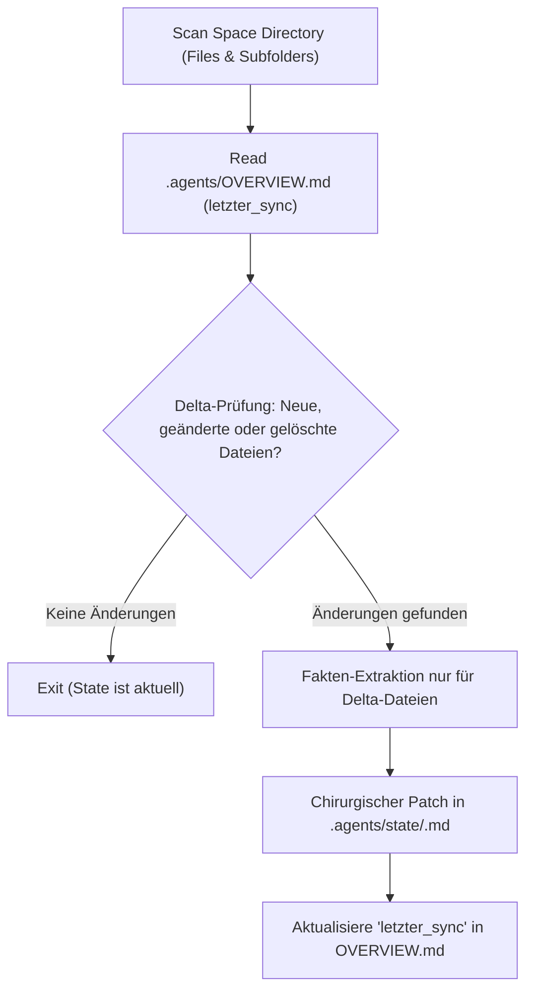

# Space Sync Skill (Cognitive Hub Synchronizer)

This skill governs the autonomous maintenance and synchronization of shared folder hubs (e.g. `01_LEBENSBEREICHE/`, `00_NOTFALL_RECHT_IDENTITAET/`, or SharePoint project spaces).
It bridges raw documents (PDFs, spreadsheets, images, docx) and the agentic memory layer in `.agents/state/`.

---

## 🎯 Trigger Conditions

Activate this skill when:
- The user requests: *"Sync space [name]"*, *"Gleiche den Ordner [X] ab"*, *"Aktualisiere den Ist-Stand"* or *"Prüfe neue Dokumente im Notfallordner"*.
- When an agent enters a shared space to answer a factual question and detects newer files via mtime check.
- As the final step of `inbox-triage` when files are moved into a space.

---

## 📋 Synchronization Workflow

### 1. Delta-Erkennung (Anti-Noise & Fast Path)
1. Read `.agents/OVERVIEW.md` to get `letzter_sync` and the active topic routes.
2. List files in the target subfolder(s) and compare file modification times (`mtime`) and filenames against the existing tables in `.agents/state/<thema>.md`.
3. If no new or modified files exist: Terminate immediately without reading file contents.

### 2. Gezielte Fakten-Extraktion
For each new or changed document:
- **Zero-Output & Security First:** Never extract or log passwords, credentials, or private access keys. Only document the existence of the file.
- **Biophysikalischer Kausalitäts-Filter:** Extract only factual parameters:
  - *Vertrag / Urkunde:* Gegenstand, Vertragspartner, Polizzen-/Aktenzeichen, Bindung, Kündigungsfrist, Prämie/Betrag.
  - *Finanzen / Rechnung:* Rechnungssteller, Datum, Brutto-/Nettobetrag, Zahlungsstatus.
  - *Behörde / Ausweis:* Person, Ausweisart, Ausstellungsdatum, Ablaufdatum / Gültigkeit.
  - *Technik / Haus:* Anlagentyp, Zählpunkt, Leistung (kWp/kWh), Wartungsintervall.
- **SSOT-Backlink:** Always format the entry with a relative markdown link to the physical file:
  `[Dateiname.pdf](../Unterordner/Dateiname.pdf)`

### 3. State-Update (Chirurgischer Patch)
- Use `view_file` to read the current state of `.agents/state/<thema>.md`.
- Use `replace_file_content` to append or update the table/section surgically. Never overwrite the entire file with `write_to_file`.
- Update the frontmatter timestamp `letzter_sync: YYYY-MM-DD`.

### 4. Overview-Touch
- Update `letzter_sync` in `.agents/OVERVIEW.md`.
- Inform the user concisely with a 1-3 line summary of what was updated.
